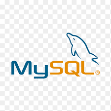

<a name="top"></a>


<h1 align="center" >Aiudo Test - Bank API</h1>


<br/>
<br/>
<br/>


:speech_balloon: [About](#id1)   

:speech_balloon: [Descripcion y requisitos](#id2)  

:hammer: [Herramientas](#id3)

:clipboard: [Instalación](#id4)

:eye_speech_bubble: [Endpoints](#id4)


---

<a name="id1"></a>
## **About**

Realización de una prueba técnica de Backend con Laravel para Aiudo.

**Start date:** 04/08/2021
**Deadline:** 05/08/2021

**Contributors:**
* [Mariana Fernández Sacristán](https://github.com/mlfernandez)

---

<a name="id2"></a>

## **Descripcion y requisitos**

> Diseñar una API REST simulando un sistema bancario, que permite acceso al cliente con un sistema seguro de login, el acceso a diferentes consultas.
Además del modelo de Usuario, debe contener los siguientes:
* Cuentas Bancarias,
* Préstamos,
* Historial de pagos.
También debe incluir la funcionalidad de reseteo de contraseña.

**Modelo Entidad Relación:**


---

<a name="id3"></a>

## **Herramientas**

Se utilizaron las siguientes tecnologías:

|  | Visual Studio Code |

|  | Laravel | 

|  | PHP | 

|  | MySql | 

|  | Docker | 

|  | Git |

|  | GitHub | 


<a name="id4"></a>


## **Instrucciones**


<h3> Comenzando el proyecto </h3>
   
Instalamos Laravel

```javascript
composer global require laravel/installer
```
Creamos el proyecto

```javascript
laravel new aiudoBack
```

Modelos

```javascript
php artisan make:model Account
php artisan make:model Loan
php artisan make:model Payment
```

Migraciones

```javascript
php artisan make:migration create_accounts
php artisan make:migration create_loans
php artisan make:migration create_payments
```

Controladores

```javascript
php artisan make:controller PassportAuthController
php artisan make:controller AccountController --api --model=Account
php artisan make:controller LoanController --api --model=Loan
php artisan make:controller PaymentController --api --model=Payment
php artisan make:controller UserController --api --model=User
```

Instalamos Passport y hacemos migracion
```javascript
$ composer require laravel/Passport
php artisan migrate
php artisan passport:install
```

<a name="id5"></a>

## Endpoints

#### Admin

1. Login Administrador
2. Buscar todos los usuarios
3. Crear accounts
4. Crear loans
5. Logout
6. Resetear password

#### Users

1. Login user
2. Detalles de usuario
3. Detalles accounts
4. Detalles loans
5. Crear un pago
5. Ver historial payments
6. Resetear password
7. Logout


[UP](#top)
